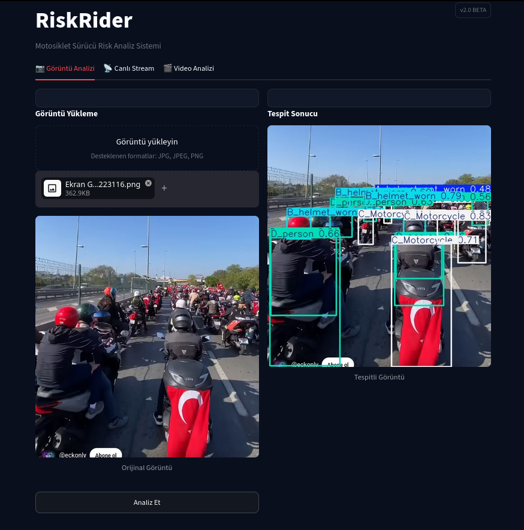
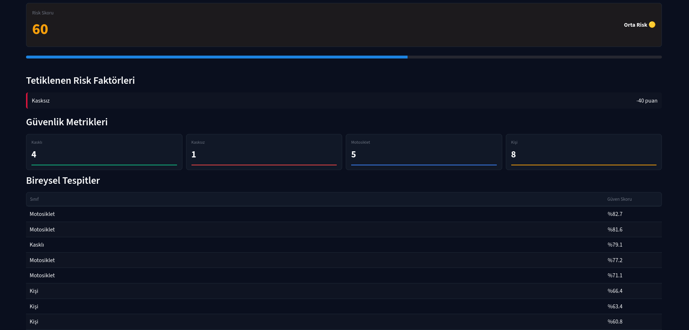
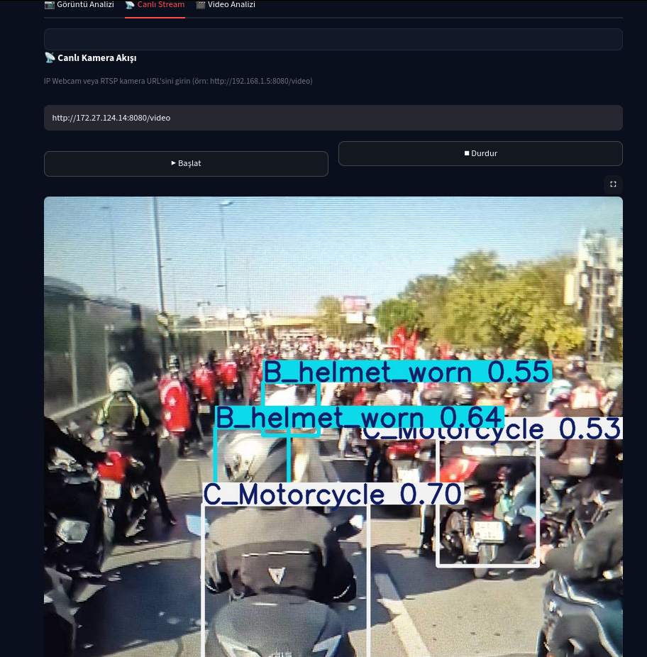
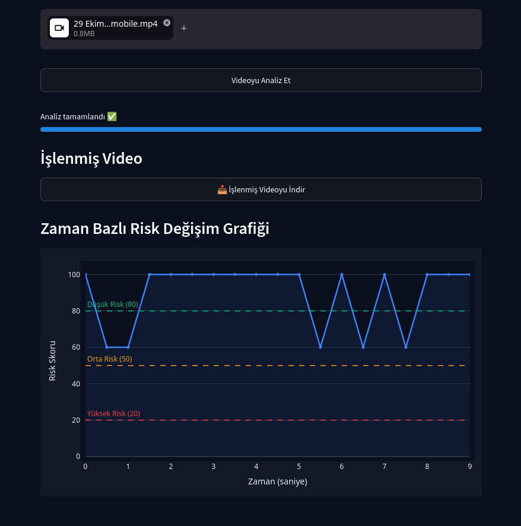

# RiskRider

RiskRider, motosiklet suruculerinin guvenligini analiz eden, goruntu, canli yayin ve video uzerinden risk skoru ureten yapay zeka destekli bir web uygulamasidir. Sistem YOLO tespitlerini kullanir ve Streamlit arayuzu ile kullanimi kolay bir deneyim sunar.

## Ozellikler

- Goruntu yukleyip tek tikla analiz
- Canli IP Webcam/RTSP akisi uzerinden anlik tespit ve skor
- MP4 video analizi ve zaman bazli risk grafigi
- Tespitli goruntu ve detayli tespit listesi
- Risk skoru ve risk seviyesi etiketleri

## Ekran Goruntuleri

### Goruntu Analizi





### Canli Yayin



### Video Analizi



## Kurulum

Sistem genelinde pip kurulumlari PEP 668 sebebiyle engellenebilecegi icin sanal ortam (venv) onerilir.

```bash
python -m venv .venv
source .venv/bin/activate
pip install -r requirements.txt
```

## Calistirma

```bash
python -m streamlit run app.py
```

Ardindan tarayicida su adresi acin:

```
http://localhost:8501
```

## Kullanim

### Goruntu Analizi

- JPG/JPEG/PNG formatinda goruntu yukleyin.
- "Analiz Et" butonuna basin.

### Canli Yayin

- IP Webcam URL'si girin.
- Ornek: http://IP_ADRESI:8080/video
- "Baslat" butonuna basin.

### Video Analizi

- MP4 video dosyasi yukleyin.
- "Videoyu Analiz Et" butonuna basin.

## Model

Uygulama, proje kok dizininde bulunan `best.pt` model dosyasini kullanir. Dosya yoksa sistem pasif gorunur ve tespitler calismaz.

## Risk Skoru Mantigi

Baslangic skoru 100'dur. Kasksiz tespitinde skor 40 puan azalir. Minimum skor 0'dur.

## Teknolojiler

- Python
- Streamlit
- Ultralytics YOLO
- OpenCV
- Pillow
- NumPy
- Plotly

## Proje Hakkinda

- Universite donem projesi olarak gelistirilmistir.
- Kurye guvenligi ve is guvenligi senaryolari icin tasarlanmistir.
